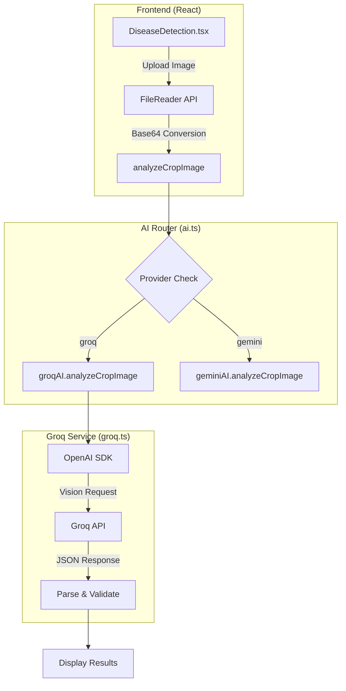
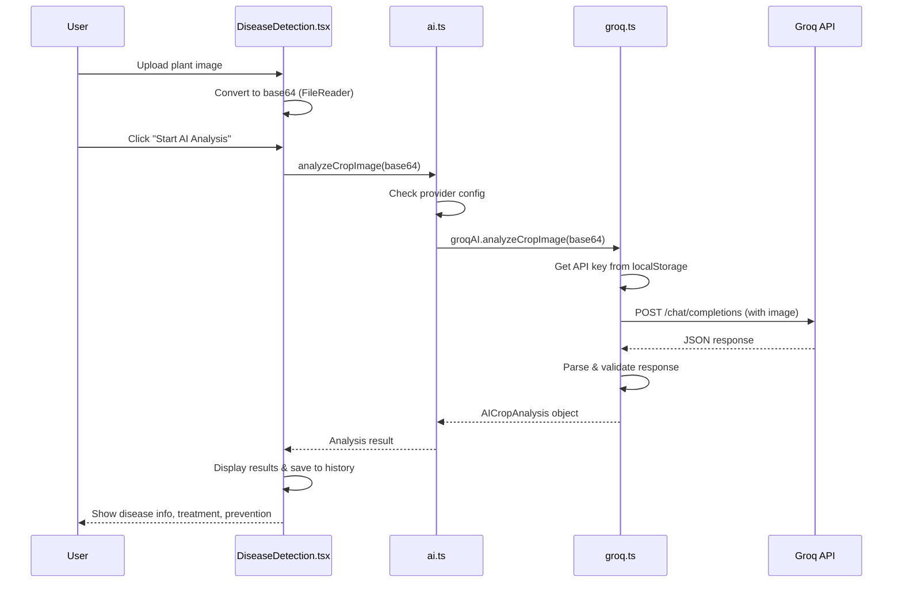

# Groq Vision Model Implementation

> **Complete Technical Documentation for Crop Disease Detection using Groq's Vision-Capable LLM**

## 📋 Overview

Farm-Connect implements **Groq's Llama 4 Scout Vision Model** (`meta-llama/llama-4-scout-17b-16e-instruct`) for AI-powered crop disease detection. This document provides a complete technical breakdown of the implementation.

---

## 🏗️ Architecture



---

## 📁 File Structure

| File | Purpose |
|------|---------|
| [src/lib/groq.ts](file:///c:/Users/marsh/OneDrive/Desktop/MAJOR%20PROJECT/Farm-Connnect/src/lib/groq.ts) | Groq AI service with vision model integration |
| [src/lib/ai.ts](file:///c:/Users/marsh/OneDrive/Desktop/MAJOR%20PROJECT/Farm-Connnect/src/lib/ai.ts) | Centralized AI routing between Groq and Gemini |
| [src/pages/DiseaseDetection.tsx](file:///c:/Users/marsh/OneDrive/Desktop/MAJOR%20PROJECT/Farm-Connnect/src/pages/DiseaseDetection.tsx) | UI component for image upload and results display |

---

## 🔧 Core Implementation

### 1. Groq Client Setup (`groq.ts`)

The Groq service uses the **OpenAI SDK** with Groq's base URL for compatibility:

```typescript
import OpenAI from 'openai';

const getAPIKey = () => {
    const userAPIKey = localStorage.getItem('groq_api_key');
    return userAPIKey || '';
};

class GroqAIService {
    private getClient() {
        const apiKey = getAPIKey();
        if (!apiKey) {
            throw new Error('Groq API key not configured. Please add it in Settings.');
        }
        return new OpenAI({
            baseURL: "https://api.groq.com/openai/v1",
            apiKey: apiKey,
            dangerouslyAllowBrowser: true,  // Required for browser-side API calls
        });
    }

    updateAPIKey(apiKey: string) {
        localStorage.setItem('groq_api_key', apiKey);
    }

    removeAPIKey() {
        localStorage.removeItem('groq_api_key');
    }
    
    // ... methods
}

export const groqAI = new GroqAIService();
```

> [!IMPORTANT]
> **Key Design Decisions:**
> - API keys are stored in `localStorage` for user-specific configuration
> - `dangerouslyAllowBrowser: true` enables client-side API calls (no backend proxy needed)
> - OpenAI SDK is used for compatibility since Groq's API follows OpenAI's format

---

### 2. Vision Analysis Method

The core method `analyzeCropImage` sends base64-encoded images to Groq's vision model:

```typescript
export interface AICropAnalysis {
    disease: string;
    confidence: number;
    severity: 'Low' | 'Medium' | 'High';
    description: string;
    treatment: string[];
    prevention: string[];
    affectedArea: number;
}

async analyzeCropImage(imageBase64: string): Promise<AICropAnalysis> {
    try {
        const client = this.getClient();

        const prompt = `You are a specialized plant pathologist and entomologist. Analyze this image of a crop/plant for diseases and pest infestations.

If the image is not a plant, indicate that clearly.
If it is a healthy plant with no visible issues, state that.

IMPORTANT: Look for BOTH diseases AND pests:

Common crop DISEASES in India:
- Late Blight, Early Blight for tomatoes/potatoes
- Rust diseases for wheat
- Bacterial leaf blight for rice
- Powdery mildew for various crops
- Leaf spot diseases
- Fungal and bacterial infections

Common crop PESTS (insects/infestations):
- Aphids (small green/yellow insects clustered on leaves/stems)
- Whiteflies (tiny white flying insects)
- Spider Mites (tiny dots, webbing on leaves)
- Caterpillars/worms (visible larvae eating leaves)
- Thrips, Mealybugs, Scale insects
- Any visible insect infestation

If you detect ANY issue (disease OR pest infestation), set hasDisease to true.
For pests, set disease name to the specific pest (e.g., "Aphid Infestation", "Whitefly Attack", "Spider Mite Damage").

Respond with a JSON object with this exact structure:
{
  "isPlant": boolean (true if image is of a plant),
  "hasDisease": boolean (true if plant has disease OR pest infestation),
  "disease": string (name of disease/pest or "Healthy Plant"),
  "confidence": number (0-100),
  "severity": string ("Low", "Medium", or "High"),
  "description": string (brief description with visual evidence),
  "treatment": array of strings (treatment steps),
  "prevention": array of strings (prevention methods),
  "affectedArea": number (percentage 0-100)
}`;

        const response = await client.chat.completions.create({
            model: "meta-llama/llama-4-scout-17b-16e-instruct",  // Vision-capable model
            messages: [
                {
                    role: "user",
                    content: [
                        {
                            type: "text",
                            text: prompt
                        },
                        {
                            type: "image_url",
                            image_url: {
                                url: imageBase64  // Base64 data URL
                            }
                        }
                    ]
                }
            ],
            max_tokens: 1500,
            temperature: 0.2,  // Low temperature for consistent, accurate results
        });

        const content = response.choices[0]?.message?.content;

        if (!content) {
            throw new Error("Empty response from Groq API");
        }

        // Extract JSON from response (handles markdown code blocks)
        let jsonText = content.trim();
        const jsonMatch = jsonText.match(/```(?:json)?\s*(\{[\s\S]*\})\s*```/);
        if (jsonMatch) {
            jsonText = jsonMatch[1];
        }

        const result = JSON.parse(jsonText);

        // Validate response structure
        if (typeof result.isPlant === 'undefined' || typeof result.disease === 'undefined') {
            throw new Error("Invalid response structure from Groq API.");
        }

        // Handle non-plant images
        if (!result.isPlant) {
            return {
                disease: 'Not a Plant',
                confidence: 95,
                severity: 'Low' as const,
                description: 'The uploaded image does not appear to be a plant. Please upload a clear image of a crop or plant.',
                treatment: ['Upload a valid plant image'],
                prevention: ['Ensure proper image capture'],
                affectedArea: 0
            };
        }

        // Return the analyzed result
        return {
            disease: result.disease,
            confidence: Math.round(result.confidence),
            severity: result.severity as 'Low' | 'Medium' | 'High',
            description: result.description,
            treatment: result.treatment,
            prevention: result.prevention,
            affectedArea: Math.round(result.affectedArea)
        };

    } catch (error) {
        console.error('Groq API error:', error);
        throw new Error('Could not get a diagnosis from the Groq model. Please check your API key and try again.');
    }
}
```

> [!NOTE]
> **Model Selection:** The **Llama 4 Scout 17B** model was chosen because:
> - It's a vision-capable model that can process images
> - High accuracy for agricultural/plant identification tasks
> - Fast inference times on Groq's LPU infrastructure
> - Supports multimodal inputs (text + image)

---

### 3. AI Router (`ai.ts`)

The centralized AI router allows switching between Groq and Gemini:

```typescript
import { geminiAI, AICropAnalysis } from './gemini';
import { groqAI } from './groq';

export type ModelProvider = 'gemini' | 'groq';

export interface ModelConfig {
    diseaseDetection: ModelProvider;
    chatbot: ModelProvider;
}

const SETTINGS_KEY = 'farm-connect-model-settings';

const getDefaultConfig = (): ModelConfig => ({
    diseaseDetection: 'groq',  // Default to Groq for disease detection
    chatbot: 'groq',
});

export const getModelConfig = (): ModelConfig => {
    try {
        const stored = localStorage.getItem(SETTINGS_KEY);
        if (stored) {
            const parsed = JSON.parse(stored);
            return { ...getDefaultConfig(), ...parsed };
        }
    } catch (error) {
        console.error('Error loading model config:', error);
    }
    return getDefaultConfig();
};

export const saveModelConfig = (config: ModelConfig): void => {
    try {
        localStorage.setItem(SETTINGS_KEY, JSON.stringify(config));
    } catch (error) {
        console.error('Error saving model config:', error);
    }
};

// Centralized crop image analysis
export const analyzeCropImage = async (imageBase64: string): Promise<AICropAnalysis> => {
    const config = getModelConfig();
    const provider = config.diseaseDetection;

    console.log(`🔬 [AI] Crop Disease Analysis using: ${provider.toUpperCase()}`);

    if (provider === 'groq') {
        return groqAI.analyzeCropImage(imageBase64);
    } else {
        return geminiAI.analyzeCropImage(imageBase64);
    }
};

// Re-export for backward compatibility
export { geminiAI, groqAI };
export type { AICropAnalysis };
```

---

### 4. Frontend Integration (`DiseaseDetection.tsx`)

The UI handles image upload and triggers the AI analysis:

```typescript
import { analyzeCropImage } from "@/lib/ai";

// State management
const [selectedImage, setSelectedImage] = useState<string | null>(null);
const [isAnalyzing, setIsAnalyzing] = useState(false);
const [result, setResult] = useState<DetectionResult | null>(null);

// Image upload handler - converts file to base64
const handleImageUpload = (file: File) => {
    if (file && file.type.startsWith('image/')) {
        const reader = new FileReader();
        reader.onload = (e) => {
            setSelectedImage(e.target?.result as string);  // Base64 data URL
            setResult(null);
            toast({
                title: "Image Uploaded",
                description: "Ready for AI analysis",
            });
        };
        reader.readAsDataURL(file);  // Convert to base64
    } else {
        toast({
            title: "Invalid File",
            description: "Please select a valid image file",
            variant: "destructive",
        });
    }
};

// Analysis trigger
const startAnalysis = async () => {
    if (!selectedImage) return;

    setIsAnalyzing(true);
    setUploadProgress(0);

    // Progress indicator
    const progressInterval = setInterval(() => {
        setUploadProgress(prev => {
            if (prev >= 100) {
                clearInterval(progressInterval);
                return 100;
            }
            return prev + 10;
        });
    }, 200);

    try {
        // Call the centralized AI function
        const aiResult = await analyzeCropImage(selectedImage);
        
        setResult(aiResult);

        toast({
            title: "AI Analysis Complete",
            description: `AI Analysis with ${aiResult.confidence}% confidence`,
        });

        // Save detection to local storage for history
        detectionStorage.saveDetection({
            crop: 'Unknown Crop',
            disease: aiResult.disease,
            confidence: aiResult.confidence,
            severity: aiResult.severity,
            treatment: aiResult.treatment,
            userId: user?.id,
            location: user?.location
        });

    } catch (error) {
        console.error('Analysis error:', error);
        
        toast({
            title: "Analysis Error",
            description: "Using fallback analysis. Please check your internet connection.",
            variant: "destructive"
        });
    } finally {
        setIsAnalyzing(false);
    }
};
```

---

## 📊 Response Schema

The vision model returns a structured JSON response:

```typescript
interface VisionModelResponse {
    isPlant: boolean;           // Whether the image contains a plant
    hasDisease: boolean;        // Whether disease/pest is detected
    disease: string;            // Disease name or "Healthy Plant"
    confidence: number;         // 0-100 percentage
    severity: 'Low' | 'Medium' | 'High';
    description: string;        // Visual evidence description
    treatment: string[];        // Array of treatment steps
    prevention: string[];       // Array of prevention methods
    affectedArea: number;       // Percentage of plant affected (0-100)
}
```

---

## 🔐 API Key Management

Users configure their Groq API key in the Settings/Profile page:

```typescript
// Save API key
groqAI.updateAPIKey(apiKey);  // Stores in localStorage

// Remove API key
groqAI.removeAPIKey();  // Removes from localStorage

// Check if key exists
const hasKey = !!localStorage.getItem('groq_api_key');
```

---

## 🌐 Request Flow



---

## ⚙️ Configuration Options

| Setting | Value | Location |
|---------|-------|----------|
| **Model** | `meta-llama/llama-4-scout-17b-16e-instruct` | `groq.ts` line 83 |
| **Max Tokens** | `1500` | `groq.ts` line 101 |
| **Temperature** | `0.2` | `groq.ts` line 102 |
| **Base URL** | `https://api.groq.com/openai/v1` | `groq.ts` line 25 |
| **Default Provider** | `groq` | `ai.ts` line 14 |

---

## 🧪 Testing the Implementation

1. **Get a Groq API Key:** Visit [console.groq.com](https://console.groq.com) to create an account and generate an API key

2. **Configure the Key:** Go to Settings/Profile in the app and enter your Groq API key

3. **Test Disease Detection:**
   - Navigate to the Disease Detection page
   - Upload a clear image of a plant (healthy or diseased)
   - Click "Start AI Analysis"
   - View results including disease identification, confidence, treatment, and prevention

---

## 🔄 Switching Providers

Users can switch between Groq and Gemini in settings:

```typescript
import { saveModelConfig } from '@/lib/ai';

// Switch to Groq
saveModelConfig({
    diseaseDetection: 'groq',
    chatbot: 'groq'
});

// Switch to Gemini
saveModelConfig({
    diseaseDetection: 'gemini',
    chatbot: 'gemini'
});
```

---

## 📚 Dependencies

```json
{
    "openai": "^6.9.1"  // Used for Groq API compatibility
}
```

> [!TIP]
> The OpenAI SDK is used because Groq's API is OpenAI-compatible. Simply changing the `baseURL` redirects all requests to Groq's infrastructure.

---

## 🚨 Error Handling

The implementation includes comprehensive error handling:

1. **Missing API Key:** Throws error prompting user to configure key
2. **Empty Response:** Validates that API returns content
3. **Invalid JSON:** Handles markdown-wrapped JSON responses
4. **Non-Plant Images:** Returns specific message for invalid inputs
5. **Network Errors:** Fallback to mock data with user notification

---

## 📈 Performance Considerations

| Aspect | Implementation |
|--------|---------------|
| **Latency** | Groq's LPU delivers sub-second inference |
| **Image Size** | Base64 encoding increases payload by ~33% |
| **Token Limit** | 1500 tokens balances detail vs. speed |
| **Temperature** | 0.2 ensures consistent, deterministic outputs |

---

## 🎯 Future Improvements

- [ ] Add image compression before upload
- [ ] Implement offline caching for common diseases
- [ ] Add crop type auto-detection
- [ ] Support batch image analysis
- [ ] Add confidence threshold warnings

---

**Last Updated:** December 21, 2025
